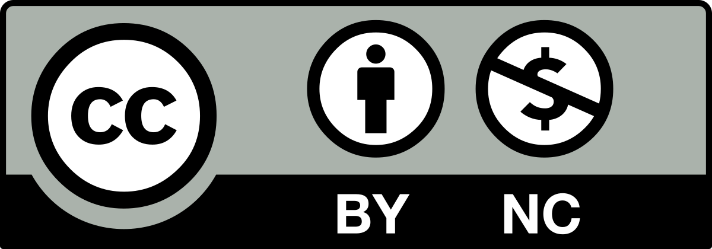

# Proyecto fin de ciclo

## Descrición

Mi aplicación se llama `Pokémon Santiago de Compostela`. En este proyecto se va a desarrollar un videojuego que utiliza elementos de la enorme saga de juegos `Pokémon`, en el que el jugador es un **Estudiante de Programación Pokémon** (EPP) de Santiago de Compostela y debe superar su etapa estudiantil. Para ello, tendrá que enfrentarse a numerosas pruebas diseñadas por el profesorado del centro y deberá llegar a final de mes con el dinero suficiente para poder vivir en Santiago, avanzando así en la trama. El juego actualmente termina al final del primer trimestre estudiantil.

## Sobre la autoría

Como creador de este proyecto, Iván Cabaleiro Poceiro, declaro mi autoría en el mismo. Soy un programador junior, que empezó en el mundo de la programación hace poco. Vengo de realizar el ciclo medio de `Sistemas Microinformáticos y Redes` (SMR) y estoy en camino de obtener el título superior de `Desenvolvimiento de Aplicaciones Multiplataforma`, estando ya en mi segundo año en el IES San Clemente (Santiago de Compostela).

Principalmente domino los **lenguajes de programación**: Java, C# y Kotlin. También tengo conocimientos, en menor medida, de Python, y manejo algunos lenguajes web (HTML, CSS...) además de saber trabajar con bases de datos. Además, manejo adecuadamente Git, lo que ha sido de gran ayuda para realizar este proyecto junto a mis compañeros.

En mi etapa como estudiante he llegado a utilizar **herramientas** como Unity, Android Studio, Visual Studio Code, NetBeans, IntelliJ, entre otras, para los trabajos asignados.

**Mi objetivo final** con este proyecto es aplicar todo lo aprendido durante estos dos años y crear mi propio juego basado en la gran saga de Pokémon que marcó mi infancia y la de muchos.

## Licencia

## Índice

1. [Estudo preliminar](doc/templates/1_estudo_preliminar.md)
2. [Análise](doc/templates/2_analise.md)
   - [Planificación](doc/templates/21_planificacion.md)
   - [Orzamento](doc/templates/22_orzamento.md)
3. [Deseño](doc/templates/3_deseño.md)
4. [Codificación e probas](doc/templates/4_codificacion_probas.md)
5. [Manuais do proxecto](doc/templates/5_manuais.md)
   - [Referencias](doc/templates/51_referencias.md)
