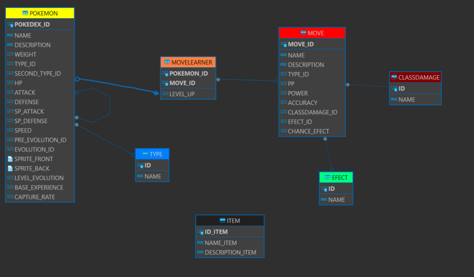
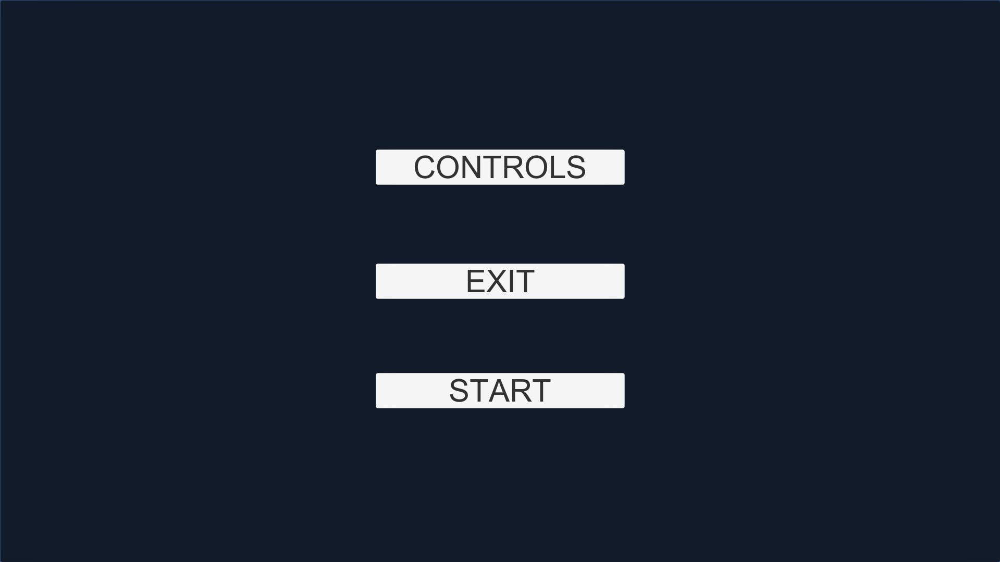
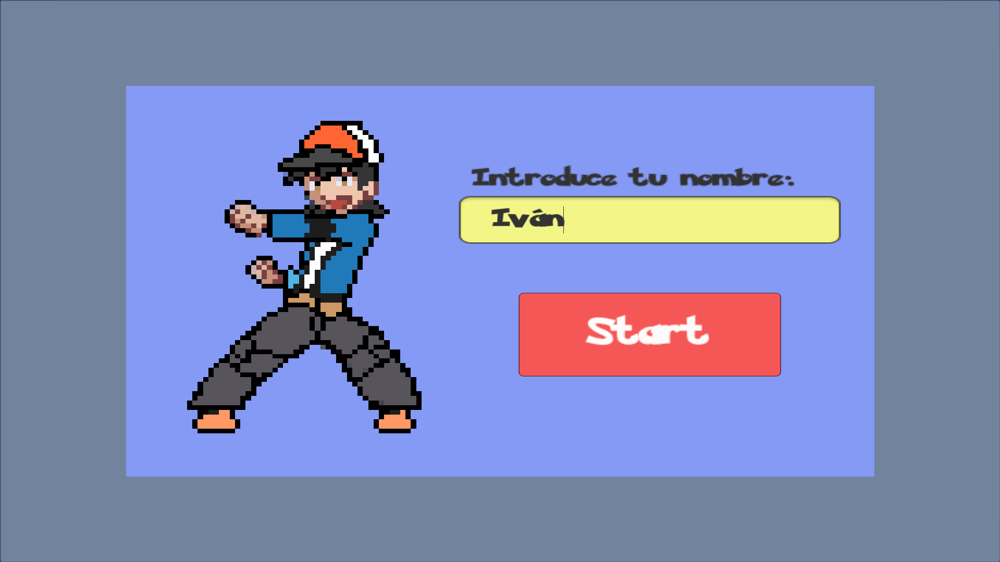
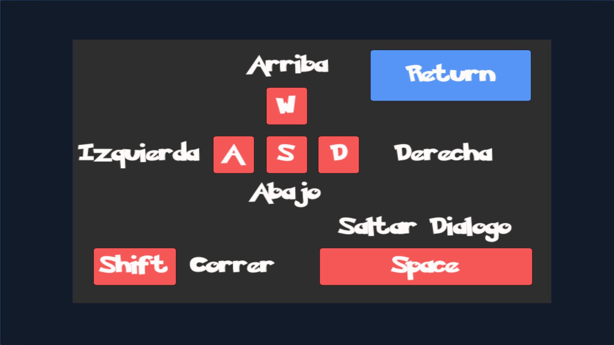
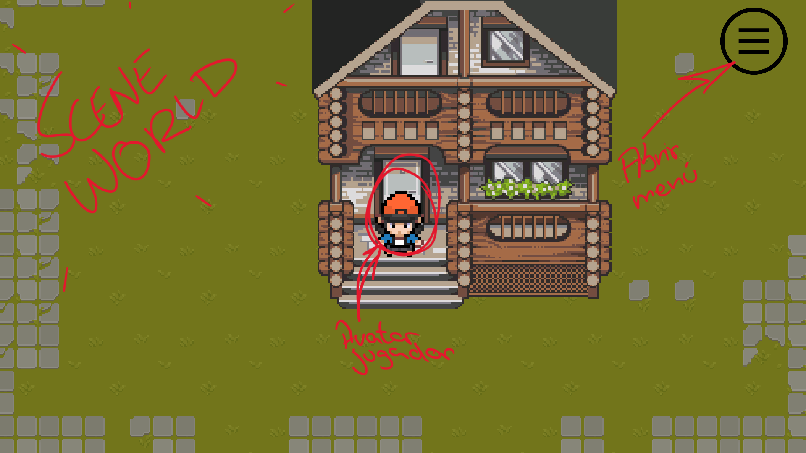
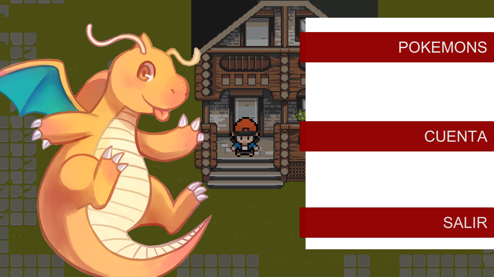
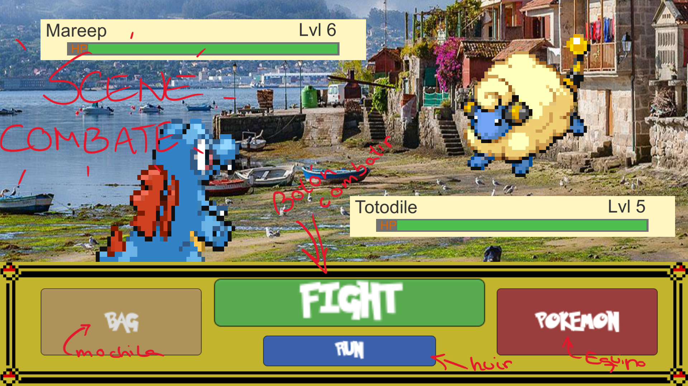

# Deseño

## Diagrama da arquitectura

El usuario interactuara con la interfaz de la aplicación, accediendo, sin darse cuenta de que a la **base de datos local** que tendrá guardada en el juego y utilizando archivos de estado de juego o de partidas guardadas que se almacenará en un JSON.

Para su comodidad y disfrute del juego, este dispondrá de ciertas facilidades para acceder a la información sin ningún tipo de problema y podrá utilizar en otro ordenador el archivo de la partida en el juego, siendo así `partidas portables`.

## Diagrama de Base de Datos

### Diagrama Relacional

Mejora a futuro. Implementación de datos y de una buena entidad en la BBDD de los **items**

### Diagrama entidad Relación

`**[Opcional]**` Si me da tiempo puede que implemente a NPCs en la base de datos con sus dialogos y sprites

## Deseño de interface de usuarios

### Menú de Inicio/Titular

### Opciones de nuevo juego

### Iniciar al jugador

### Menú de Controles

### Vista del mundo

### Menu de juego

### Interfaz de combate

