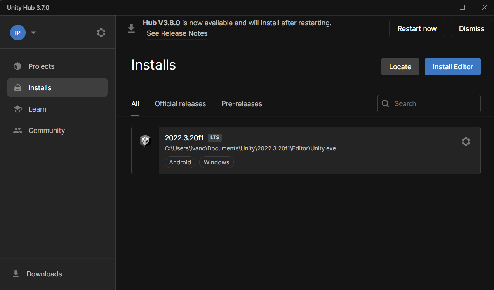

# Manual técnico del proyecto

## Requisitos

- Visual Studio Code
- Unity
- .NET
- DBeaver

### Instalación de herramientas

1. **Instalación de Visual Studio Code**

   Instala [**Visual Studio Code**](https://support.academicsoftware.eu/hc/es/articles/360006916138-C%C3%B3mo-instalar-Microsoft-Visual-Studio-Code) siguiendo el manual de instalación.

   Activa las extensiones necesarias:

   
   

2. **Instalación de .NET**

   Descarga y sigue los pasos de instalación indicados en la página de [**.NET**](https://dotnet.microsoft.com/es-es/download).

   

3. **Instalación de Unity**

   Sigue la [guía de instalación de Unity](https://academia.sobrevilla.mx/wp-content/uploads/2020/04/Guia-de-instalacion-Unity-2020.pdf), que incluye un ejemplo de cómo añadir la licencia y el editor. En nuestro caso, el editor recomendado es el LTS 2022.3.20f1.

   

4. **Instalación de DBeaver**

   Sigue los pasos del manual de instalación de [**DBeaver**](https://eva.fing.edu.uy/pluginfile.php/491863/mod_resource/content/5/Instructivo%20instalaci%C3%B3n%20Dbeaver.pdf), cambiando PostgreSQL por SQLite. Una vez instalado, ábrelo; no debería requerir nombre de usuario ni contraseña.

### Mejoras futuras

Las posibles mejoras que se pueden implementar están relacionadas principalmente con aspectos que no pude completar o que quedaron *semi-implementados*.

Con **semi-implementadas** me refiero, por ejemplo, a los movimientos, que están todos presentes, pero tanto la descripción como el nombre están en inglés. O la mochila, que no está preparada para añadir muchos tipos diferentes de ítems.

Una de las mejoras más importantes para mí es la mochila. El sistema está preparado para cargarla y guardarla correctamente, y hay muchos ejemplos de extracción de datos, lo que facilita la simulación. Otro punto importante sería ampliar la tabla de la base de datos de ítems, que tuve que reducir a Poké Balls y pociones (Pokevieiras y Estrellas Galicia).

Además, en los centros Pokémon, sería útil implementar una caja de Pokémon para poder cambiar el equipo. Dado que se trata de una etapa corta del juego, no lo consideré necesario inicialmente.

Por último, sería beneficioso ampliar el juego para cubrir todo el curso estudiantil.